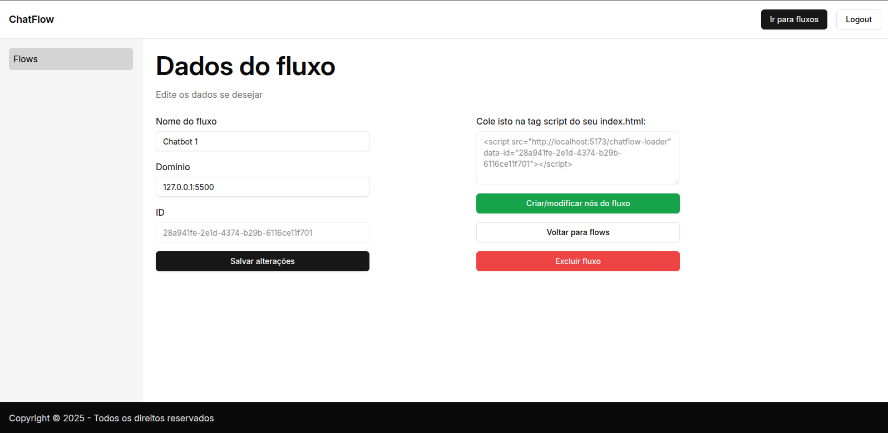

# Chatflow

## O que é?

Chatflow é um projeto full stack que permite que pessoas criem chatbots através de uma interface visual simples e incluam em seu site sem escrever código.

## Tecnologias utilizadas

- **Front-end:** React, React Router v7 (antigo Remix), Zustand, Shadcn
- **Back-end:** Node.js, Prisma
- **Validação:** Zod

## Como funciona?

1. Você cria uma conta
2. Cria um chatbot, especificando em qual domínio o chatbot deve funcionar
3. Edita o fluxo conversacional
4. Após salvar, inclui a tag `<script>` disponibilizada pela plataforma (na página de dados do bot) no `<head>` do site desejado
5. O widget do chatbot aparecerá no canto inferior direito da tela

## Prints

### Tela de login


### Home


### Criar chatbot


### Dados do chatbot



### Editar fluxo conversacional


### Adicionando script no site do cliente


### Widget na página do cliente


### Chatbot em ação


## Rodando localmente

Siga os passos abaixo para rodar o projeto localmente:

1. **Clone o repositório**

   ```bash
   git clone https://github.com/mateusdotjs/chatflow-lite.git
   ```

2. **Acesse a pasta**

   ```bash
   cd chatflow-lite
   ```

3. **Instale as dependências**

   ```bash
   npm install
   ```

4. **Rode o servidor de desenvolvimento**
   ```bash
   npm run dev
   ```

O projeto está configurado para rodar no localhost, utilizando a porta padrão do Vite (5173). É possível alterar este endereço criando um arquivo .env e setando as variaveis VITE_DOMAIN e DOMAIN para o endereço que você desejar.
